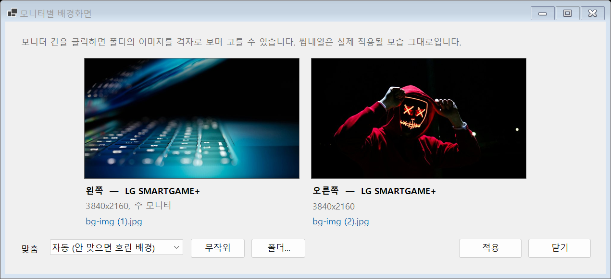
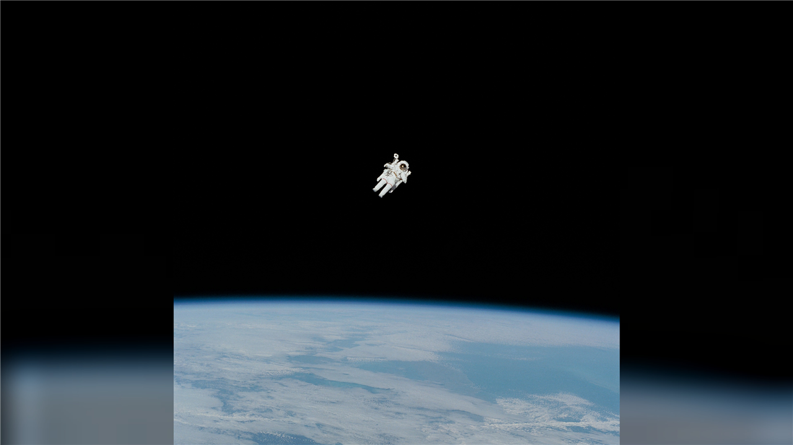
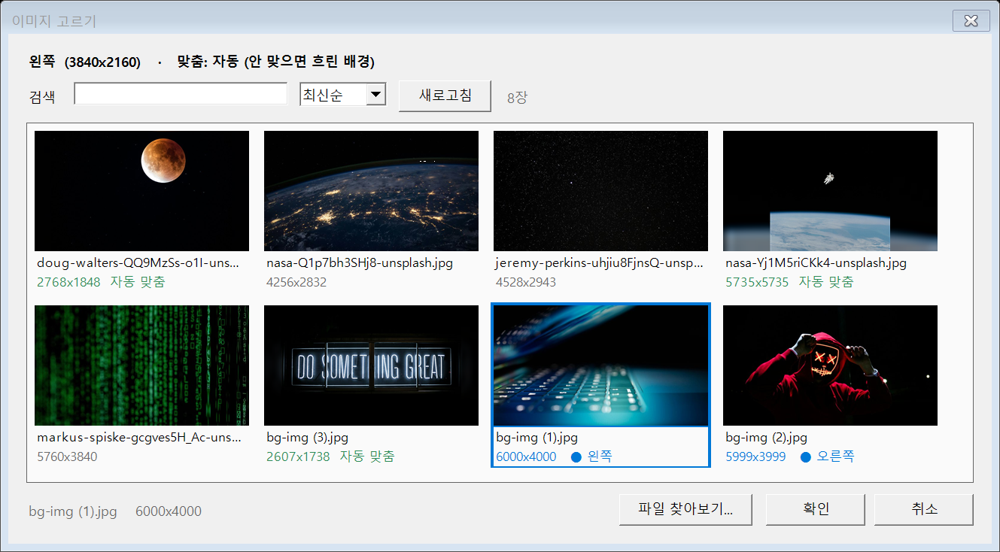

<p align="center">
  
</p>

# Per-Monitor Wallpaper

**모니터마다 다른 배경화면을, 잘리지 않게.**
Set a different wallpaper on each monitor — without cropping.

Windows 10/11 · PowerShell 7 · 설치 불필요 (스크립트만)



---

## 왜 만들었나 / Why

Windows 설정으로도 모니터별 배경화면을 지정할 수는 있습니다. 다만 실제로 쓰다 보면 걸리는 게 있습니다.

| | Windows 설정 | 이 도구 |
|---|---|---|
| 모니터 번호 | 1/2/3 — 물리적 배치와 무관 | **왼쪽 / 가운데 / 오른쪽** (좌표 기준) |
| 최근 이미지 | 5개까지만 유지 | 폴더 전체를 격자로 |
| 잘리는 부분 | 적용 후에야 확인 | **적용 전 미리보기** |
| 비율이 안 맞는 이미지 | 잘리거나 늘어남 | **흐린 배경으로 합성 (손실 0%)** |

Windows numbers displays 1/2/3 in an order unrelated to where they physically sit, keeps only
5 recent images, and gives you no way to see the crop before applying. This tool fixes all three,
and adds an auto-fit mode that composes an exactly-sized image so nothing ever gets cropped.

---

## 자동 맞춤 / Auto-fit

이미지 비율이 모니터와 다르면, 잘라내는 대신 **모니터 해상도에 정확히 맞는 이미지를 만들어** 넣습니다.
뒤에는 같은 이미지를 확대·블러 처리해 채우고, 앞에는 원본 전체를 얹습니다.

When an image doesn't match the display's aspect ratio, it composes a new image at the exact
display resolution: the same picture blurred and darkened as a backdrop, the full original on top.

정사각형 5735×5735 → 3840×2160 (기존 방식이면 44% 손실):



무조건 합성하지는 않습니다. 재인코딩은 화질 손해라 필요할 때만 합니다.

| 조건 | 처리 |
|---|---|
| 모니터보다 작아 확대해야 함 | 합성 |
| 잘림이 25%를 넘음 | 합성 |
| 그 외 (예: 3:2 사진 → 16:9, 16% 잘림) | 원본 그대로 채우기 |

---

## 설치 / Install

```
git clone https://github.com/techjuicelab/per-monitor-wallpaper.git
cd per-monitor-wallpaper
```

PowerShell 7 이 필요합니다. 없으면:

```powershell
winget install Microsoft.PowerShell
```

---

## 사용 / Usage

### GUI

**`Wallpaper.bat`** 더블클릭.

1. 모니터 칸을 클릭하면 이미지 갤러리가 열립니다
2. 타일을 고릅니다 — 타일에 보이는 그대로가 실제 적용될 모습입니다
3. **적용**



갤러리에서:
- **`자동 맞춤`** (초록) — 이 이미지는 합성으로 들어갑니다
- **`확대됨`** (빨강) — 자동 맞춤을 끈 상태에서 모니터보다 작은 이미지
- **`● 왼쪽`** (파랑) — 다른 모니터에서 이미 쓰는 중
- 검색 / 정렬(최신순·이름순·크기순) / 새로고침 / 폴더 밖 이미지 찾아보기

이미지 폴더는 **`폴더...`** 버튼으로 바꿉니다. 선택은 기억됩니다.

### 명령줄 / Command line

```powershell
.\Set-Wallpaper.ps1 -List      # 지금 뭐가 걸려 있는지
.\Set-Wallpaper.ps1 -WhatIf    # 적용 전 미리보기
.\Set-Wallpaper.ps1            # 적용
```

`Set-Wallpaper.ps1` 상단 블록에서 모니터별 이미지를 지정할 수 있습니다. 비워두면 폴더의
이미지를 이름순으로 자동 배정합니다.

```powershell
$Assign = [ordered]@{
    LEFT  = 'sunset.jpg'
    RIGHT = 'forest.jpg'
}
$Position = 'Auto'
```

---

## 모니터 이름 / Display labels

배치를 보고 자동으로 정합니다. Windows 의 디스플레이 번호가 아니라 **실제 좌표** 기준이라,
케이블을 다른 포트에 옮겨 꽂아도 이름이 그대로입니다.

| 배치 | 라벨 |
|---|---|
| 1대 | `ONLY` |
| 가로 2대 / 3대 | `LEFT` `RIGHT` / `LEFT` `CENTER` `RIGHT` |
| 세로 2대 / 3대 | `TOP` `BOTTOM` / `TOP` `MIDDLE` `BOTTOM` |
| 4대 이상, 격자 | `MON1` `MON2` … (읽는 순서) |

높이가 다른 모니터를 나란히 둬서 위아래가 조금 어긋나도 가로 한 줄로 인식합니다.

---

## 언어 / Language

Windows 표시 언어가 한국어면 한국어, 아니면 영어로 나옵니다. 강제하려면:

```powershell
$env:MYWALLPAPER_LANG = 'en'   # or 'ko'
```

언어를 추가하려면 `lib\Lang.ps1` 의 `$Strings` 에 표를 하나 더 넣으면 됩니다.

---

## 구조 / Structure

```
Wallpaper.bat           GUI 실행
Wallpaper-GUI.ps1
Set-Wallpaper.bat       명령줄 실행
Set-Wallpaper.ps1
assets/
  icon.png              README 아이콘 (투명 배경)
  icon.ico              Windows 앱 아이콘
images/                 기본 이미지 폴더 (GUI 에서 변경 가능)
lib/
  Lang.ps1              UI 문구 (ko / en)
  Settings.ps1          폴더·맞춤 기억 (%LOCALAPPDATA%)
  WallpaperCom.ps1      IDesktopWallpaper COM + 모니터 배치 판정
  ThumbCache.ps1        썸네일 디스크 캐시
  ImageCompose.ps1      자동 맞춤 합성
  ImagePicker.ps1       이미지 고르기 창
```

캐시와 설정은 저장소가 아니라 `%LOCALAPPDATA%\MyWallpaper\` 에 저장됩니다.

---

## 성능 / Performance

6000×4000 JPEG 한 장을 디코딩하는 데 약 290ms 가 듭니다. 이건 줄일 방법이 없습니다 —
`GetThumbnailImage` 도, WIC 축소 디코딩도 1.3배가 한계이고, Unsplash 계열 이미지에는
내장 EXIF 썸네일이 아예 없습니다.

그래서 **한 번만 디코딩하고 디스크에 캐시**합니다.

| | 캐시 없음 | 캐시 있음 |
|---|---|---|
| 썸네일 100장 | 29초 | **0.6초** |
| 맞춤 방식 변경 | 최대 1.3초 멈춤 | **25ms** |
| 캐시 용량 | — | 100장당 약 4MB |

갤러리는 타이머로 한 칸씩 채우므로, 캐시가 없는 첫 실행에도 창이 멈추지 않습니다.

---

## 요구사항 / Requirements

- Windows 8 이상 (`IDesktopWallpaper` COM 인터페이스)
- PowerShell 7 (`winget install Microsoft.PowerShell`)
- 관리자 권한 불필요

---

## 라이선스 / License

MIT — [LICENSE](LICENSE)
